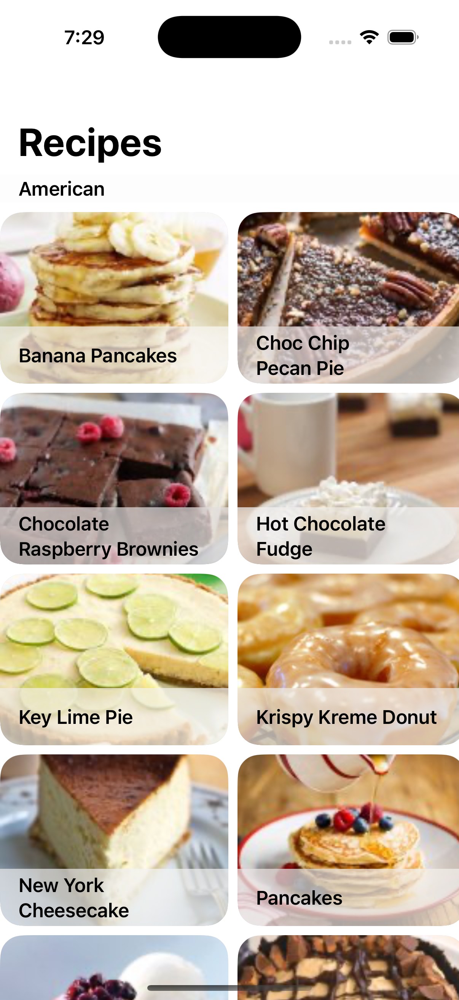

#  FetchRecipeApp

### Summary:

This is a project that demonstrates how to load data from a remote API and display it in a grid in SwiftUI efficiently. The list is a recipe list that groups the items by cuisine. You can click on the recipe and see it in the browser or see a video of how to make it.

This implementation uses only Apple libraries. It leverages robusts APIs like AsyncImage, custom caching, WKWebView among others.

### Focus Areas:

My main focus area was designing an elegant and efficient UI experience that leverages the versatility of SwiftUI. Additionally, I put a lot of effort into making the codebase manageable and modular so it can be easy to work with and maintain.

### Time Spent:

It took me around 5 hours to design, structure, and test the entirety of this project. Time was almost equally used on both conceptualizing, designing and coding the solution. The test cases where introduced as the features were added.

### Trade-offs and Decisions:

Not having access to any of the robust libraries to expedite the development process was a hindrance and required a bit more planning. The tradeof was a more basic UI experience and having to do some research on the lates API's introduced in SwiftUI that could cover the gaps. 

### Weakest Part of the Project:

I would say the UI needs a bit more polish, particularly on the main list view. There's a weird issue with the ScrollView padding that just wont apply. It's possible that it is related to one of the child views disrupting the width calculations. Appart from that, the custom cache implementation is pretty barebones simply because the AsyncImage API is more than appropriate. That being said, it can be easily enhanced to be more robust.

